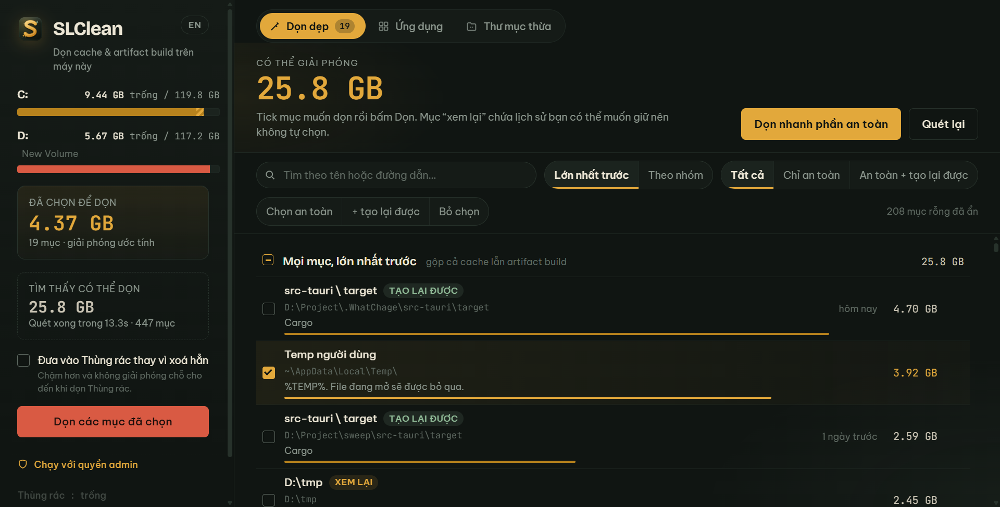

# SLClean

Dọn cache, thư mục tạm và artifact build trên Windows. Desktop app (Tauri 2 + Rust), song ngữ
Việt/Anh, không có bước nào tự xoá: bạn tick, bạn xác nhận, rồi nó mới xoá.

**Tải bản dùng ngay** ở trang [Releases](../../releases): `SLClean_<version>_x64-setup.exe`
(bộ cài, cho user hiện tại, không đòi admin) hoặc `SLClean-portable.exe` (chạy không cần
cài). File chưa ký số nên Windows SmartScreen hỏi lần đầu: chọn *More info → Run anyway*.

*English:* clean caches, temp folders and build artifacts on Windows. Tauri 2 + Rust desktop
app, Vietnamese/English UI, nothing is deleted until you tick it and confirm. Grab the
installer or the portable exe from [Releases](../../releases); the binary is unsigned, so
SmartScreen asks once.



## Chạy từ mã nguồn

Cần Rust (stable, MSVC) và Node 18+. Lần đầu chạy `npm install` để lấy Tauri CLI.

```
run-slclean.cmd
```

Hoặc trực tiếp: `src-tauri\target\debug\slclean.exe`. App tự quét khi mở (khoảng 15 s trên
máy có ~450 mục; lần đầu có thể lâu hơn vì Windows chưa cache metadata).

Bản cài đặt (.exe NSIS, không cần Rust để chạy):

```
npm run build          # = npx tauri build; cần ~2 GB trống cho thư mục target
```

Kết quả ở `src-tauri\target\release\bundle\nsis\SLClean_<version>_x64-setup.exe`, cạnh đó là
`src-tauri\target\release\slclean.exe` chạy không cần cài. Cài cho user hiện tại, không đòi
admin. Nếu ổ chứa dự án chật, trỏ thư mục build sang ổ khác trước khi chạy lệnh trên:

```
set CARGO_TARGET_DIR=C:\tmp\slclean-release-out
```

khi đó kết quả nằm ở `C:\tmp\slclean-release-out\release\...`. Để phát hành,
`powershell -File scripts\make-release-bundles.ps1` làm trọn bước này rồi gom bộ cài, exe
portable và `SHA256SUMS.txt` vào `release\`; đính ba file đó lên GitHub Release.

## Cách phân loại

| Nhãn | Nghĩa | Tự tick |
|---|---|---|
| (không nhãn) | cache thuần, app tự tạo lại khi cần | có |
| `tạo lại được` | mất thì phải tải/build lại (`npm install`, `cargo build`, Gradle deps) | không |
| `xem lại` | có dữ liệu của bạn: transcript AI, backup, thư mục tạm cá nhân | không |
| `cần admin` | thư mục hệ thống, chỉ dọn được khi chạy elevated — ô tick bị khoá | không |
| `một phần` | có thư mục con không đọc được nên số đo thiếu | — |

## Những gì được quét

Không có đường dẫn nào ghi cứng theo máy. Mọi vị trí suy từ biến môi trường Windows
(`%LOCALAPPDATA%`, `%APPDATA%`, `%TEMP%`, `%SystemRoot%`, `%ProgramData%`) hoặc của công cụ
(`CARGO_HOME`, `GRADLE_USER_HOME`, `GOPATH`, `GOCACHE`, `PIP_CACHE_DIR`, `UV_CACHE_DIR`,
`PLAYWRIGHT_BROWSERS_PATH`…). Mục không tồn tại trên máy thì không hiện.

- **Công cụ AI:** Claude Code (transcript, file-history, shell snapshots, debug, todo,
  paste cache, temp), Codex CLI (sessions, log, archived), Orca, Gemini CLI, Hugging Face,
  PyTorch, Ollama, LM Studio, Playwright, Puppeteer, chrome-devtools-mcp.
- **Kho gói:** npm, pnpm, Yarn, Bun, Deno, pip, uv, Poetry, Cargo (registry cache/src, git),
  rustup downloads, Go (mod + build cache), Gradle (caches, daemon, wrapper, JDK tự tải),
  Maven, NuGet, Composer, pub, Scoop, Android, Electron, node-gyp, Cypress, Unity, Unreal DDC.
- **Trình soạn thảo:** mọi app họ VS Code phát hiện qua `User\workspaceStorage` (VS Code,
  Insiders, Cursor, Windsurf, Trae, VSCodium…): cache, VSIX đã tải, logs, workspaceStorage,
  lịch sử file cục bộ. JetBrains: từng sản phẩm dưới `%LOCALAPPDATA%\JetBrains`.
- **Trình duyệt:** *từng profile* của Chrome, Chrome Beta/Canary, Edge, Brave, Vivaldi,
  Chromium, Arc, Cốc Cốc, Opera/GX (Cache, Code Cache, GPUCache, Dawn, Service Worker) với
  tên profile lấy từ `Local State`; Firefox, Zen, Floorp, LibreWolf, Waterfox (cache2,
  startupCache, thumbnails). Đăng nhập, mật khẩu, bookmark không nằm trong các thư mục này.
- **Ứng dụng:** mọi app Electron có `Cache` + `Code Cache` dưới Roaming/Local (Discord,
  Claude Desktop, Slack, Figma, Notion, Blockbench, Termius…), Spotify, Telegram, Zoom,
  OneDrive logs, Adobe media cache, Remote Desktop, app Microsoft Store (`TempState`,
  `AC\INetCache`).
- **Game:** Steam (shader cache ở mọi thư viện đọc từ `libraryfolders.vdf`, tải dở, web
  cache), Minecraft launcher (webcache, logs, assets/libraries, versions), Modrinth, Prism,
  Epic.
- **Windows:** Temp người dùng, `Windows\Temp`, Windows Update Download, Delivery
  Optimization, CBS logs, WER, CrashDumps, D3DSCache, shader cache NVIDIA/AMD/Intel, driver
  NVIDIA đã tải, INetCache, thumbnail cache, Package Cache (Visual Studio).
- **Thư mục tạm ở gốc ổ đĩa và thư mục home:** `tmp`, `temp`, `*-temp`, `tmp-*`…
  (đánh dấu `xem lại`), `OneDriveTemp`/`WUDownloadCache`/`DeliveryOptimization` (an toàn),
  `$WinREAgent`/`$WINDOWS.~BT`/`Windows.old` (xem lại, cần admin).
- **Artifact build:** `node_modules`, `target` (cạnh Cargo.toml/pom.xml), `build`, `out`,
  `dist`, `bin`/`obj` (.NET), `.venv`, `__pycache__`, `.next`, `.nuxt`, `.turbo`, `.gradle`,
  `.kotlin`, `Library`/`Temp` (Unity), `cmake-build-*`, `run` (server test Paper)… Mỗi cái
  đối chiếu với dấu hiệu dự án bên cạnh để không nhầm thư mục trùng tên. Thư mục cài Node
  (nvm/fnm) và app Electron đã cài (`resources\app`, `.asar.unpacked`, msys, Program Files)
  không bao giờ bị coi là artifact.

Artifact được tìm trên **mọi ổ đĩa cố định và thư mục người dùng**, bỏ qua Windows, Program
Files, ProgramData, WindowsApps, Steam, msys, OneDrive và các thư mục `.x` trong home. Hộp
**Cài đặt** cho thêm thư mục (ổ mạng, ổ ngoài) hoặc loại trừ nơi không muốn quét; cài đặt
lưu ở `%APPDATA%\vn.salyyy.slclean\settings.json`.

## Cách xem và lọc

- `Lớn nhất trước` (mặc định): trộn cache lẫn artifact vào một danh sách, sắp theo dung
  lượng giảm dần. `Theo nhóm` chia theo nguồn.
- Ô tìm kiếm lọc theo tên, đường dẫn hoặc ghi chú; `Esc` để xoá.
- `Chỉ an toàn` / `An toàn + tạo lại được`: ẩn các mục còn lại. Mục đã tick không bao giờ bị
  ẩn. Mục rỗng cũng được ẩn cho gọn; dòng chữ bên phải cho biết đang ẩn bao nhiêu.
- `Dọn nhanh phần an toàn`: tick mọi mục an toàn đang hiện rồi mở thẳng hộp xác nhận.
- `Chọn an toàn` / `+ tạo lại được` chỉ tick trong phạm vi đang hiện và bỏ qua mục cần admin.
- Bấm bất kỳ đâu trên một hàng cũng tick được. Cách xem, bộ lọc, ngôn ngữ được nhớ lại.
- Trong lúc quét, danh sách hiện ngay với nhãn `đang đo` và số tăng dần; con số lớn ở đầu
  bảng và thanh mảnh bên dưới cho biết tiến độ.

## Quyền admin

Nút `Chạy với quyền admin` ở góc dưới trái mở lại app qua UAC rồi tự đóng bản hiện tại. Khi
chưa elevated, các mục `cần admin` (dưới `%SystemRoot%`, `%ProgramData%`, `$WinREAgent`,
`$WINDOWS.~BT`, `Windows.old`) bị khoá tick thay vì báo lỗi lúc dọn.

## Giới hạn đã biết

- File đang mở bị bỏ qua và báo số lượng, không làm hỏng cả mục.
- Đường dẫn được bảo vệ (gốc ổ đĩa, `%SystemRoot%`, Program Files, ProgramData, thư mục
  home và các thư mục con chính, tool home như `.cargo`/`.gradle`/`.claude`, `.ssh`,
  WindowsApps) bị từ chối ngay cả khi UI gửi lên.
- Chỉ quét thư mục, chưa quét file đơn lẻ lớn (ví dụ `~\.codex\logs_*.sqlite` có thể lên
  tới 1 GB). Xem thủ công nếu ổ C vẫn đầy sau khi dọn.
- Chưa có lịch dọn tự động và chưa có bản macOS/Linux (mã Rust có phần Windows-only:
  UAC, single-instance qua Win32).

## Giấy phép

MIT (xem `LICENSE`). Dùng, sửa, phân phối lại tuỳ ý, chỉ cần giữ dòng bản quyền.

## Cấu trúc

```
src-tauri/src/
  lib.rs              lệnh Tauri + event stream (catalog-start/progress/item, artifact-found, clean-progress)
  catalog.rs          kiểu CatalogEntry (đa đường dẫn, nhãn 2 ngôn ngữ), Roots từ biến môi trường, dedupe
  catalog_specs.rs    bảng mục tĩnh (~95 vị trí đã biết)
  catalog_dynamic.rs  mục sinh theo máy: profile trình duyệt, app Electron, họ VS Code, JetBrains, Steam, Store, temp ở gốc ổ
  project_roots.rs    gốc quét artifact: mọi ổ + home, danh sách chặn, thêm/loại trừ từ cài đặt
  artifacts.rs        tìm node_modules/target/build… theo dấu hiệu dự án bên cạnh
  sizer.rs            đo dung lượng bằng read_dir (không stat thêm từng file), báo tiến trình
  cleaner.rs          xoá thẳng hoặc qua Thùng rác + danh sách đường dẫn bảo vệ
  settings.rs         settings.json (ngôn ngữ, thư mục thêm/loại trừ, chế độ Thùng rác)
  recycle_bin.rs      Thùng rác qua SHQueryRecycleBin/SHEmptyRecycleBin: một lời gọi, không liệt kê từng mục
  elevation.rs        kiểm tra elevated + mở lại qua UAC
  single_instance.rs  một bản chạy mỗi lần; --after-pid khi chuyển sang admin
  drives.rs           ổ đĩa cố định qua sysinfo
  parallel.rs         pool thread cố định dùng chung cho hai pha quét
ui/
  index.html                      bố cục (rail trái, hero, viewbar, sổ cái, 3 dialog)
  js/i18n-strings.js              chuỗi vi/en, t(), L(), applyI18n()
  js/ledger-view-and-rows.js      tạo hàng, hai cách xem, bộ lọc, tìm kiếm, tính tổng
  js/settings-dialog.js           hộp cài đặt, chọn thư mục qua dialog hệ thống
  js/slclean-app.js                 quét, dọn, ổ đĩa, ngôn ngữ, sự kiện
  css/                            theo vùng giao diện; fonts.css sinh bởi scripts/fetch-google-fonts-offline.mjs
design/app-icon.html              nguồn icon (SVG); render → design/app-icon.png → `npx tauri icon`
scripts/
  verify-ui-in-headless-chrome.mjs     UI với cầu nối __TAURI__ giả (i18n, tìm kiếm, cài đặt, dọn)
  launch-app-with-devtools-port.ps1    mở app thật với cổng DevTools
  drive-real-app-via-devtools.mjs      đọc số liệu thật từ DOM app đang chạy + chụp ảnh
  probe-real-app-settings-commands.mjs kiểm tra roundtrip settings trên app thật
  make-throwaway-artifact-fixture.ps1  dự án giả 3 MB trong D:\tmp
  e2e-delete-fixture-in-real-app.mjs   xoá thật fixture qua hộp xác nhận của app
  measure-recycle-bin-command-in-real-app.mjs  đo lệnh Thùng rác trên app thật, kiểm tra cửa sổ còn trả lời
  make-release-bundles.ps1             build ra ổ khác, gom bộ cài + portable + SHA256SUMS vào release\
```

Test Rust: `cargo test --manifest-path src-tauri\Cargo.toml` (23 test: bảo vệ đường dẫn,
xoá file bị khoá, mục nhiều thư mục, đo song song, phân loại artifact, loại trừ, dedupe
danh mục, phân loại thư mục tạm, quyền admin, Thùng rác). Test UI: `node scripts/verify-ui-in-headless-chrome.mjs`
(cần Chrome cài sẵn và `playwright-core` từ `npm install`).
